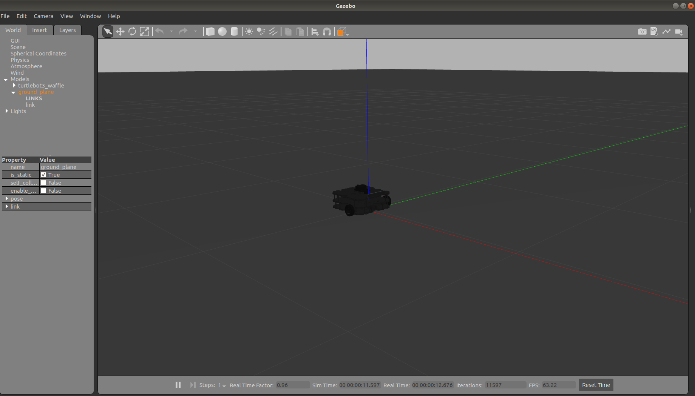
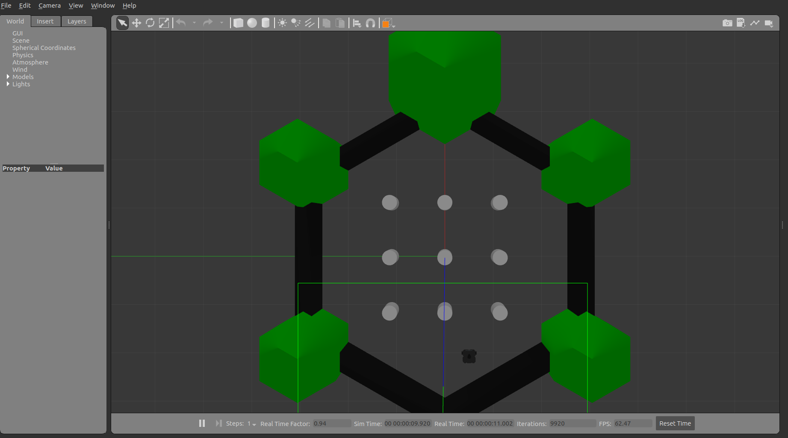
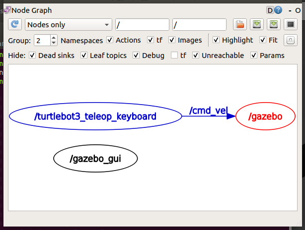

# Turtlebot3仿真代码研究
由于在学习ros的过程中,发现教程中介绍到的Turtlebot3具有较为完备的硬件设计,以及软件驱动功能包,十分适合我们项目在算法仿真上的工作.所以就此展开对turtlebot3的学习,将重点研究可能用到的机器人运动/LDS/Slam等几个部分.

涉及到的turtlebot3功能包的安装与测试,可参考我之前的学习笔记<相关软件和功能包的安装>,这里不再介绍

首先,通过ros学习教程介绍的仿真代码,我首先定位到以下可能相关的功能包:
+ 第一部分. 构建仿真世界
```
$ export TURTLEBOT3_MODEL=waffle
 #构建空白的世界,只有地板和机器人模型
$ roslaunch turtlebot3_gazebo turtlebot3_empty_world.launch
 #或运行这个,构建包含一个实验场地和一个机器人的世界
$ roslaunch turtlebot3_gazebo turtlebot3_world.launch
```
两条roslaunch命令运行的结果分别是:



+ 第二部分. 使用键盘驱动机器人
```
$ export TURTLEBOT3_MODEL=waffle
 #通过wasdx控制前进,左转,停止,右转,后退
$ roslaunch turtlebot3_teleop turtlebot3_teleop_key.launch
```

+ 第三部分. 随机移动并避免撞墙
```
$ export TURTLEBOT3_MODEL=waffle
$ roslaunch turtlebot3_gazebo turtlebot3_simulation.launch
```

## 1. turtlebot3_teleop包代码研读
这个包的代码路径为: catkin_ws/src/turtlebot3/turtlebot3_teleop      
当然也可以使用"roscd+包名"命令通过命令行进入到目录.

### 1.1 launch文件
首先,来看看turtlebot3_teleop_key.launch文件中的内容:
```
<launch>
  <arg name="model" default="$(env TURTLEBOT3_MODEL)" doc="model type [burger, waffle, waffle_pi]"/>
  <param name="model" value="$(arg model)"/>

  <!-- turtlebot3_teleop_key already has its own built in velocity smoother -->
  <node pkg="turtlebot3_teleop" type="turtlebot3_teleop_key" name="turtlebot3_teleop_keyboard"  output="screen">
  </node>
</launch>
```
比较简单,这个 .launch 文件定义了一个名为"model"的变量,默认值为系统中的变量 TURTLEBOT3_MODEL ,这也就是为什么我们需要在程序运行之前输入"export TURTLEBOT3_MODEL=waffle"的原因,作用是指明使用的机器人型号,以显示出不同的机器人模型.

此外,还向master节点注册了一个参数,(键)名为"model",作用是方便在代码中区分不同型号机器人执行的逻辑,参数的值为先前定义的 model 变量的值

最后,向master节点注册了一个运行节点,指明运行的包名为"turtlebot3_teleop",实际运行节点的名称为"turtlebot3_teleop_key",运行文件名为"turtlebot3_teleop_keyboard",运行过程中的调试信息输出到屏幕上.

### 1.2 node节点运行文件(.py)
该文件在turtlebot3目录下的node目录中,代码使用python编写

#### 1.2.1 包导入以及参数定义
由于代码部分比较长,这里就不粘帖使得篇幅过长了,对于不是很精深的代码,也不贴出了.读者可自行打开文件对照阅读

文件从"geometry_msg/msg"路径导入的"Twist.msg"文件,绝对路径为"/opt/ros/melodic/share/geometry_msg/msg"(我用的是melodic版本),文件内容也很简单
```
# This expresses velocity in free space broken into its linear and angular parts.
Vector3  linear
Vector3  angular
```
可见,也就是定义了两个速度向量,分别代表线速度和角速度.

使用"os.name=='nt'"这个逻辑表达式,是用于判断代码运行的环境是linux下还是windows下,应该是为了处理不同操作系统环境下从键盘读取输入字母.

之后,定义了不同机器人型号对应的最大速度(角速度,线速度),以及机器人运动的最小单位

#### 1.2.2 功能(辅助)函数
+ getKey()       
函数的基本功能是获取键盘上输入的一个字符,如果是windows操作系统,直接调用getch()函数获取,如果为linux/os系统则使用输入流,读取第一个字符
+ vels()        
输出当前的线速度和角速度数值
+ makeSimpleProfile()       
根据当前速度以及预计达到速度,调整当前速度.即预计速度比当前速度大时,增加当前速度,比当前速度小时,则减小当前速度
+ constrain()       
限制机器人的运行速度,使其速度不能超过最大角速度或线速度
+ checkLinearLimitVelocity()        
调用constrain()函数,根据机器人型号,限制机器人角速度
+ checkAngularLimitVelocity()       
调用constrain()函数,根据机器人型号,限制机器人线速度

#### 1.2.3 程序运行主函数
这一部分首先根据操作系统类型,做必要的键盘输入字符获取准备工作(linux).然后想master节点注册本节点的名字为"turtlebot3_teleop",并注册一个Topic通信,名为"cmd_vel",使用的数据类型(对象为 Twist ).此外,还在参数服务器中获取了需要仿真的机器人型号      
通过循环,不断从键盘中读入字符,当检测到为'w','x','a','d','s'(或空格)时作出相对应的机器人速度改变操作,最后将改变后的速度赋值给 Twist.linear.x 或 Twist.angular.z 并发布出去,完成一次迭代.     
程序的异常处理程序是控制机器人停止移动      

值得一提的是,程序通信中使用的 Twist 中的 Vector3 ,我们实际上只是设置了 **线速度的x方向** 和 **角速度的z方向** ,而其他方向的值均设置为0.     
这是因为ros中的坐标轴中,就线速度而言,x轴方向指向机器人的正前方,y轴方向指向机器人的正左侧,z轴方向指向机器人正上方,由于我们只需要机器人向正前方前进,靠旋转来控制机器人朝向,所以只需要用到x轴.     
机器人的旋转方向满足 **"右手定则"** ,即右手卷住的方向为正方向.由于我们只需要机器人在水平面上旋转(总不可能翻滚吧!),所以是为z轴(也就是拇指指向的方向)赋值.举个栗子,机器人要向左旋转速度为1.0,那么应该将1.0赋给Twist.angular.z,使其能够绕z轴正方向(机器人左侧)旋转

通过"rqt_grath"命令得到各节点间通信的关系图,说明我们键盘输入的控制信息通过 cmd_vel 话题(Topic)发给 gazebo 节点,由其进行机器人的控制,进一步了解电机如何驱动机器人运行可以查找了解


## 2. turtlebot3_simulation(随机避碰运动)部分代码研读

我们在运行这部分代码的时刻可以知道,该仿真的功能包是 "turtlebot3_gazebo" ,代码的 .launch 文件绝对路径为:     
> ~/catkin_ws/src/turtlebot3_simulation/turtlebot3_gazebo/launch/turtlebot3_simulation.launch

### 2.1 launch文件
打开文件后, .launch文件代码为:
```
<launch>
  <arg name="cmd_vel" default="/cmd_vel"/>
  <arg name="name" default="turtlebot3"/>

  <param name="cmd_vel_topic_name" value="$(arg cmd_vel)"/>

  <node name="$(arg name)_drive" pkg="turtlebot3_gazebo" type="turtlebot3_drive" required="true" output="screen"/>
</launch>
```
可见, turtlebot3_simulation.launch 文件定义了两个变量,名字分别为cmd_vel和name,默认的初始值分别为"/cmd_vel"和"turtlebot3".

然后定义了一个运行参数,参数键名为"cmd_vel_topic_name",值为"$(arg cmd_vel)",即为前面定义变量"cmd_vel"的值

最后,注册本运行节点信息,节点文件名为"$(arg name)_drive",如果前面的变量默认值没有改变,那么实际上这个位置的值为"turtlebot3_drive". 节点所在功能包为"turtlebot3_gazebo",运行时的名字为"turtlebot3_drive". 同时指定如果本节点运行结束了(或被kill了),将停止运行launch文件中的所有节点. 规定将输出信息显示在终端上.
