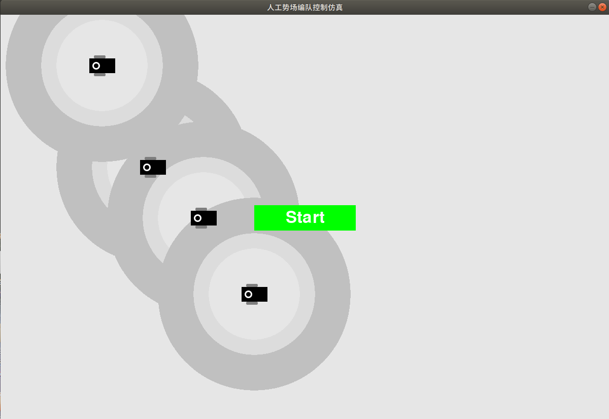
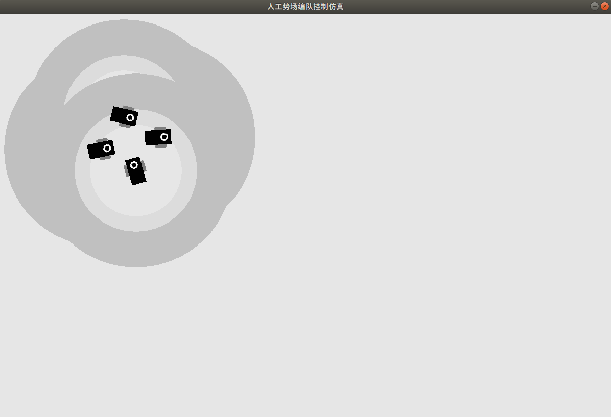

# 寒假研究学习报告(黄钰竣)

## 1. ros学习进展
我在寒假里的ros操作系统的学习,主要参考由表允晢,赵汉哲等人编写的<ROS机器人编程>(已附在本文件的压缩包中).目前学习的进度总结为:
+ 已经将书本理论以及各章节阅读学习
+ 对于ros常用的三类通信方式(Topic,Service,action),做了较为详细的python用例总结,记录了在学习过程中的练习样例(笔记见附件)
+ 安装Turtlebot3机器人代码包,并研究理解了其中涉及本项目机器人仿真的机器人驱动代码(如turtlebot3_teleop包)

## 2. 机器人编队控制算法仿真
参考论文<Formation Control of UGVs Based on Artificial Potential Field>中介绍的人工市场编队控制算法,我进行了机器人之间队形控制算法的仿真(代码附件名称为:APSimulation)     

仿真程序使用python以及pygame功能包进行编写,进行了机器人在二维平面的运动模拟,以方便后期在ros仿真上直接复用相关代码段

对于学习过程中涉及的相关代码包,软件的安装,我做了简略的笔记(见附件"相关软件及功能包安装")

仿真程序运行结果如下所示:

仿真程序的(关键)使用说明如下:
+ (1) 程序入口为simulation.py
+ (2) 仿真中的机器人是有分方向前后的,机器人必须头/尾朝向目标才能够前进/后退,不能平移.如果过方向角有偏差必须先原地旋转(最大限度模拟现实机器人移动)
+ (3) 使用鼠标点击屏幕能够瞬间移动一个机器人,测试各个方位的人工势场力情况
+ (4) 机器人周围的人工势场存在作用半径(如仿真图中的圈所示),半径参数在Settings.py文件中设置(R_a,R_m,R_r)
+ (4) 由于机器人在运动过程中,存在最小运行单位,所以每次运行会产生移动误差(角度误差/移动像素误差),机器人最终可能会做无规律运动

## 3. 后期工作目标
将在现有仿真成果上,加入障碍物/机器人领航者/目标终点,同时将会尝试使用"Distributed Formation Control of Multi-Agent
Systems Using Complex Laplacian"(使用复数普拉斯算子的编队控制...)中提到的控制算法,实现对机器人编队形成特定队形的编队控制