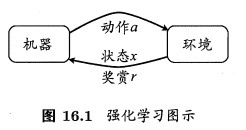
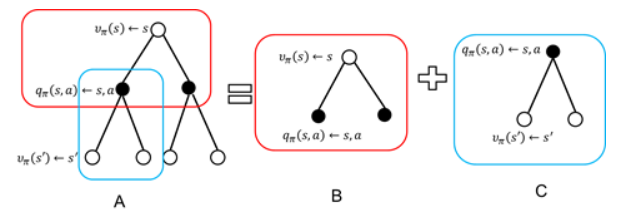
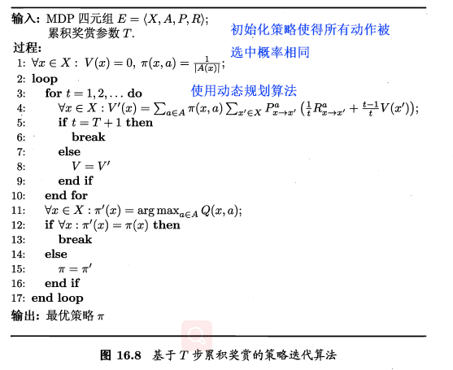
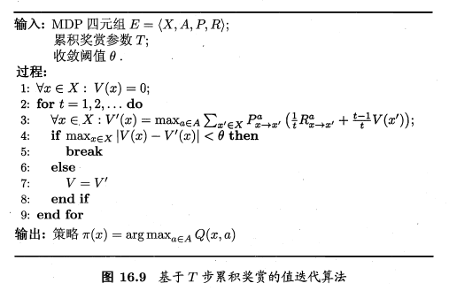
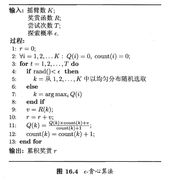
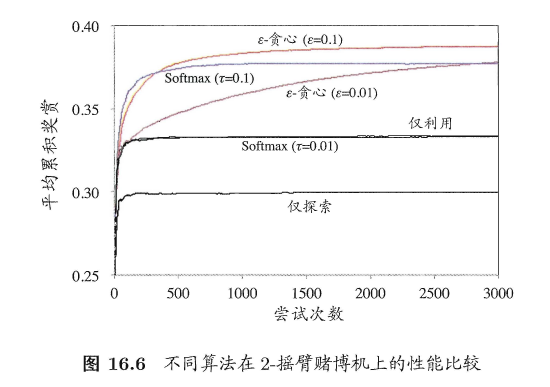
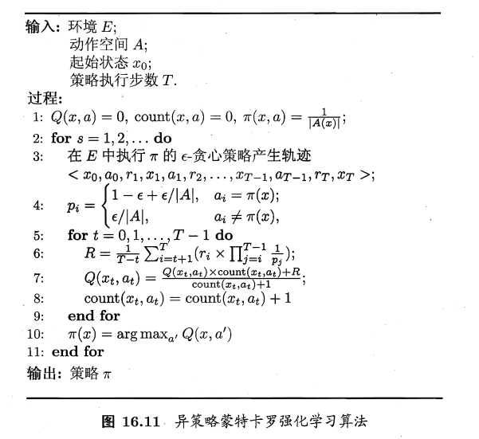
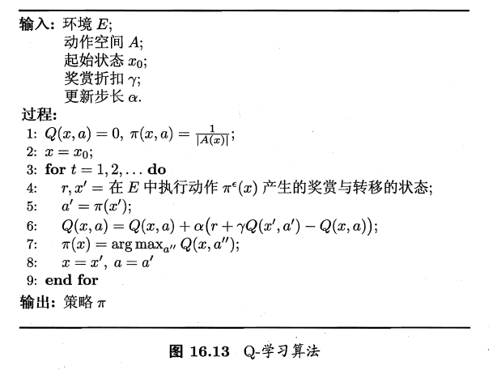

# 1. 强化学习笔记

<!-- TOC -->

- [1. 强化学习笔记](#1-强化学习笔记)
  - [1.1. 简介](#11-简介)
  - [1.2. 马尔科夫决策过程（Morkov Decision Procedure,MDP）](#12-马尔科夫决策过程morkov-decision-proceduremdp)
  - [1.3. 强化学习的分类](#13-强化学习的分类)
  - [1.4. 有模型学习](#14-有模型学习)
    - [1.4.1. 策略评估基本指标](#141-策略评估基本指标)
    - [1.4.2. Bellman等式](#142-bellman等式)
    - [1.4.3. 策略改进与策略迭代](#143-策略改进与策略迭代)
    - [1.4.4. 值迭代](#144-值迭代)
  - [1.5. 免模型学习](#15-免模型学习)
    - [1.5.1. $\epsilon$-贪心算法](#151-epsilon-贪心算法)
    - [1.5.2. Softmax算法](#152-softmax算法)
    - [1.5.3. 折中算法比较](#153-折中算法比较)
    - [1.5.4. 免模型学习的分类](#154-免模型学习的分类)
    - [1.5.5. 蒙特卡罗强化学习](#155-蒙特卡罗强化学习)
    - [1.5.6. 时序差分学习算法](#156-时序差分学习算法)

<!-- /TOC -->
## 1.1. 简介
强化学习（reinforcement learning）是机器学习的一个重要分支，其具有两个重要的基本元素：状态和动作。类似于编译原理中的自动机，或数据结构中的AOE图，强化学习研究的就是怎样找到一种最好的路径，使得不同状态之间通过执行相应动作后转换，最终到达目标状态。先介绍几个名词：
+ 状态（状态的集合一般用 $S$ 表示，某一状态标识为 $s_1,s_2,s_3,...$）      
+ 动作（动作的集合一般用 $A$ 表示，某一状态标识为 $a_1,a_2,a_3,...$）
+ 策略（一般用 $\pi$ 表示）       
常见的策略表示主要有两种不同的形式：函数形式和概率形式。在函数形式中(确定性策略)，策略是一个从状态空间向动作空间的映射，表示为 $\pi(s)\rightarrow a$ ,也就是确定了状态后，就一定要做出什么动作。在概率形式(随机性策略)，也是最常见的形式，策略给出的是确定了某一状态和动作对后，在该状态下执行该动作的概率，即 $\pi(s,a)\in (0,1)$。

强化学习与监督学习有相似之处，但又有着不同。两者都旨在寻找一种映射，从已知的状态/属性推断出动作/标记，这样强化学习类似于监督学习中的离散分类器。但强化学习还具有另外的一层特点，即强化学习的反馈往往不能立即获得，需要与环境的交互、尝试执行动作后获得，实际奖赏具有延迟性。一个比较好的例子就是，目前正在研究的路径规划问题，即处理碰到障碍物后立即知道奖赏为负数外，小车只用到达最终目标点才能获得奖赏。因此，强化学习需要通过累积的反馈信号，不断的调整策略，最终使其能够得到“在什么样的状态下选择什么样的动作可以获得最好的结果。”

## 1.2. 马尔科夫决策过程（Morkov Decision Procedure,MDP）
强化学习的模型主要使用马尔科夫决策过程来描述。先介绍 **马尔科夫性** 。定义如下：
> 定义：状态$s_t$具有马尔科夫性，当且仅当$P[s_{t+1} |s_t]=P[s_{t+1} |s_1,s_2,...,s_t]$

也就是说系统的下一状态仅与当前状态有关。若随机变量序列中的每个状态都是具有马尔科夫性，则这个随机过程就是我们常说的 **马尔科夫随机过程** 。

接着介绍 **马尔科夫过程** ，马尔科夫过程一般用二元组表示为（S,P），S代表前面提到的“状态”，P则代表状态之间的转移概率。有一系列状态组成的状态序列就称为 **马尔科夫链** 。

**马尔科夫决策过程** 则是在这些概念的基础上做的延申，是整个强化学习中最基础的模型。强化学习任务通常可以使用马尔可夫决策过程（简称MDP）来描述：机器处于环境 $E$ 中，状态空间为 $X$ ，其中每个状态 $x\in X$ 是机器感知到的环境状态的描述。机器能采取的动作构成了动作空间 $A$ ；若某个动作 $a \in A$ 作用在了当前状态 $x$ 上，则潜在转移函数 $P$ 将使得环境从当前状态按某种概率转移到另一个状态；在转移到另一个状态的同时，环境会根据潜在的“奖赏”（reward）函数 $R$ 反馈给机器一个奖赏。

在使用马尔科夫决策过程来描述强化学习时，可以使用四元组来描述，即 $(X,A,P,R)$ 。另外，有些材料在介绍强化学习时会以五元组来表示，另外多出来的一元常指的是 折扣因子 $\gamma$ 或 步长 $T$ 。折扣因子 $\gamma$ 是一个位于 $(0,1)$ 的参数，有时也被称为学习率，用于一步步折损累计奖赏值。步长 $T$ 则限定了机器能够最多获得多少步前的奖赏值。两者是影响强化学习策略收敛的影响之一，稍后介绍到 贝尔曼（Bellman）等式时就能对两者的作用有更直观的了解。

## 1.3. 强化学习的分类
了解了前面介绍的强化学习最基本概念后，为了更加清晰的分清、认识强化学习的不同算法，需要了解强化学习中的分类。这里分类的标准主要是针对“在状态空间和动作空间有限的情况下，能否从环境中获得足够的信息”这个问题。据此，强化学习任务可分为 **有模型学习** 和 **无模型学习** 。

对多部强化学习任务，我们将任务对应的马尔可夫决策过程四元组 $E=(X,A,P,R)$ 均为已知的称为 **有模型学习** ，即机器已经对环境进行了建模，能够在机器内部模拟出于环境相同或相似的状况。此时机器能够知道 状态$x$ 执行 动作$a$ 后转移到 状态$x'$ 的概率，以及转移所带来的奖赏值。

对于环境转移概率、奖赏函数未知的任务，则为 **无模型学习** 。

有模型学习 是较为简单的强化学习任务，只需使用贝尔曼(Bellman)等式不断做“策略评估-策略优化”即可。而 无模型学习 则因为还需要进一步探索环境来获取奖赏值，所以还牵扯到一个“利用-探索”的问题，相较而言更为复杂。

此外，根据在迭代过程中是否是对策略直接进行改进，还可将强化学习分为 **同策略（on-policy）** 和 **异策略（off-policy）** 强化学习。

**同策略（on-policy）** 是指进行改进和探索的是相同的一个策略，可以形象的理解为想到什么就做什么，直接按照自己的想法进行尝试。

**异策略（off-policy）** 是指学习时改进和探索使用的是不同的策略。可形象的理解为，在做出一个决策时仅在脑海中模拟出执行某一个动作后的情况，而并不采取直接的行动。

所以从整体效果上来说，虽然两者最终都会得到最优策略，但是在策略的探索形成过程中，同策略(on-policy)的算法相对表现都较为“胆小/保守”（直接先在当前策略上选动作），而异策略（off-policy）则表现得比较“大胆/冒险”。

## 1.4. 有模型学习
### 1.4.1. 策略评估基本指标
强化学习的过程实际上是不断进行策略优化的过程，因此我们必须对我们已有的策略进行策略评估。一般使用“状态值函数”(state value function)和“状态-动作值函数”(state-action value function) 对每一个状态的价值进行评估。

函数 $V^{\pi}(x)$ （状态值函数）表示从状态 $x$ 出发，使用策略 $\pi$ 所带来的累计奖赏值。（即从当前点一直使用该策略到达终点所获得的累计奖赏值）。两种定义如下。              

函数 $Q^{\pi}(x,a)$ （状态-动作函数）表示从状态 $x$ 出发，执行动作 $a$ 后再使用策略 $\pi$ 所带来的累计奖赏。两种定义如下。

值得说明一下。
+ 由于累积回报是个随机变量，而不是一个确定值，因此无法进行描述。但其期望是个确定值，因此以其期望作为状体值函数的定义。
+ 公式中期望的描述有点像概率论中的条件概率，个人认为是使用了条件期望，故需要学习补充条件期望的定义和运算形状。
+ 公式中涉及两种形式的 状态值函数 和 状态-动作值函数，即“使用$T$步累计奖赏” 和 “使用$\gamma$折扣累计奖赏”。使用“$T$步累计奖赏”时，需给定 $T$ 的值，用于限定允许最多计算 $T$ 步内的累计奖赏。使用“$\gamma$折扣累计奖赏”时，式子中的 $\gamma ^t$ 会随 $t$ 的增大而值数减小，最终使得后面的奖赏值越来越低，这也也意味着越靠前的奖赏值越重要。

### 1.4.2. Bellman等式
Bellman等式说白了就是一个递归形式的等式，能够反映 当前状态的状态值 以及 上一状态的状态值 之间的关系，从而能够一步步的推知下一状态值，最终计算出所有的状态值。           
             

推导上式的过程只需将原式展开，凑出上一状态的状态值即可。使用图来展示推导过程如下图所示。空心圆圈表示状态，实心圆圈表示状态-动作对           

得到了状态值后，也就可通过下式直接计算出该状态的状态-动作值。             

至此就能够获取所有的 状态值 和 状态-动作值 。

### 1.4.3. 策略改进与策略迭代
理想的最佳策略应该能使每个状态的累计奖赏值之和达到最大值，即：              
     
为了能够得到这个理想的最佳策略，我们需要对原策略进行改进。

最优Bellman等式就揭示了如何对现有策略进行改进。最优Bellman等式如下所示：        
    

最优Bellman等式改进策略的方式为：将策略选择的动作改为当前最优的动作，而不是像之前那样对每种可能的动作进行求和。易知：选择当前最优动作相当于将所有被选中的概率都赋给累积奖赏值最大的动作，因此每次改进都会使得值函数 **单调递增** ，进而不断接近最佳策略。进行策略优化的关键式子如下所示：           

将策略评估与策略改进结合起来，我们便得到了生成最优策略的方法：先给定一个随机策略，现对该策略进行评估，然后再改进，接着再评估、改进一直到策略收敛、不再发生改变。这便是策略迭代算法，算法流程如下所示：      

### 1.4.4. 值迭代
仔细思考就可以发现，通过策略改进的方式并不是最好的，因为它是根据最大化状态-动作函数进行改进，需要不断的进行策略评估、改进，这会通常比较耗时。

但若从最优化值函数的角度出发，即先迭代得到最优的值函数，再来计算如何改变策略，便能节省时间，这便是值迭代算法，算法流程如下所示：                

采用 $\gamma$ 折扣累计奖赏，与 $T$ 步累计奖赏 相似，只需修改值函数表达式即可。

## 1.5. 免模型学习
在实际环境中，状态转移概率、奖赏函数一般很难得到。在状态转移概率 $P$ 、奖赏函数 $R$ 均未知的条件下的学习算法就是 **免模型学习** 。

很自然的，在周围环境未知的情况下，要我们找到一条到达目标点代价最小的路径，需要我们平衡好 **探索** 和 **利用** 的关系。在“探索”时获知周围环境执行动作后的代价，在“利用”时选择花费代价最小的动作。

可以看出，上述 “探索” 和 “利用” 两种方法是相互矛盾的，仅探索法能较好地估算每个动作的期望奖赏，但是没能根据当前的反馈结果调整尝试策略；仅利用法在每次尝试之后都更新尝试策略，符合强化学习的思（tao）维（lu），但容易找不到最优动作。因此需要在这两者之间进行折中。

$\epsilon$-贪心算法、Softmax算法 是常见的折中方案。

### 1.5.1. $\epsilon$-贪心算法
$\epsilon$-贪心 就是基于一个概率来对探索和利用进行折中的方案。具体来说就是以 $\epsilon$ 的概率进行“探索”（即在所有动作中随机抽取一个执行），以 $1-\epsilon$ 的概率进行“利用”（即在已探明的动作中选择做好的一个动作执行）。$\epsilon$ 一般取一个较小的值，如0.1，则代表10%的机会会进行“探索”，90%的机会会进行“利用”。

上图所示的伪代码的使用场景是单步强化学习理论模型——— K-摇臂赌博机 。K-摇臂多播及有 K 个摇臂，赌徒在投入一个硬币后可选择按下其中一个摇臂，每个摇臂以一定概率吐出硬币，但这个概率赌徒并不知道。

### 1.5.2. Softmax算法
Softmax算法是基于当前每个动作的平均奖赏值来对 “探索” 和 “利用” 进行折中，Softmax函数将一组值（这里是奖赏值）转化为一组概率，值越大对应的概率也越高，因此当前平均奖赏值越高的动作被选中的几率也越大。

Softmax 的分布函数如下所示：

$Q(k)$ 为记录当前摇臂的平均奖赏值,$\tau>0$ 代表温度，$\tau$越小则平均奖赏高的摇臂选中概率越高。

### 1.5.3. 折中算法比较

### 1.5.4. 免模型学习的分类
免模型依据 “被评估” 和 “被改进” 的是否是同一个策略，可分为 “同策略”（on-policy） 和 “异策略” （off-policy）学习算法。在所有免模型学习算法中， **蒙特卡罗强化学习算法** 是最经典的，其可分为 “同策略蒙特卡罗强化学习算法” 以及 “异策略蒙特卡罗强化学习算法”。

由于蒙特卡罗强化学习算法是通过多次尝试后，求平均作为期望累计奖赏的近似，它在求平均时类似于“批处理”，即在一个完整采样轨迹完成后再对所有状态-动作对进行更新。若将这个过程改进称为增量式，就成为了 **时序差分学习算法** 。时序差分学习按同策略、异策略划分，就成了 **Sarsa算法** 和 **Q-学习算法**

### 1.5.5. 蒙特卡罗强化学习
所谓蒙特卡罗强化学习，就是在有模型学习的 “策略迭代算法” 中增加 $\epsilon$-贪心 ，使其同时具有 探索 和 利用 两方面动作。

与有模型学习不同的是，无模型学习每一次迭代需要先进行一次完整的轨迹采样。采样后，才能更新值函数。

**同策略蒙特卡罗强化学习** 伪代码如下所示： 

同策略蒙特卡洛强化学习在 策略评估 和 策略改进 时均使用同一个策略实现。若 策略评估 时使用 $\epsilon$-贪心，但 策略改进 时却是改进原来的策略，那么这种算法称为 **异策略蒙特卡罗强化学习** 。（可行性分析过程略）

异策略蒙特卡罗强化学习 伪代码如下所示：

值得注意的是：
+ 使用策略 $\pi '$ 来评估 策略 $\pi$ 可以证明实际上只需对累计奖赏加权。可以使用 策略 $\pi '$ 评估 策略 $\pi$ 的条件是：策略 $\pi$为确定性策略，策略 $\pi '$ 为 $\epsilon$-贪心策略

### 1.5.6. 时序差分学习算法
求期望累计奖赏的近似时，将批处理形式的“求平均”改为增量式进行，即为时序差分学习算法。修改后的累计奖赏值函数如下所示。

对于该式可以这样理解：$\alpha$ 为学习率，式子后半部分相当于一个增量，学习率越大，增量的影响就越大。

下图所示为 Sarsa算法伪代码。Sarsa算法是一种同策略算法。

下图所示为 Q-学习算法伪代码。Q-学习算法是一种异策略算法。

Sarsa算法与Q-学习算法是两种非常相似的算法，两者的区别主要在于伪代码的第4、5行。Sarsa算法会在当前状态 x 上直接执行策略 $a = \pi(x)$ ，进入到状态 $x'$ ,接着再使用贪心策略 $a'=\pi^\epsilon(x')$(即有 $\epsilon$ 的可能进行随机探索),即先使用现有策略 $\pi$ 后使用 $\pi^\epsilon$。Q-学习则正好相反，先使用 $\pi^\epsilon$ 后使用 $\pi$ 。