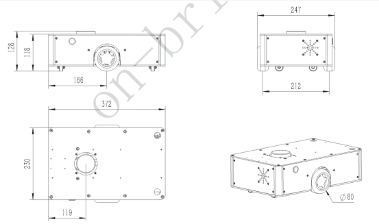
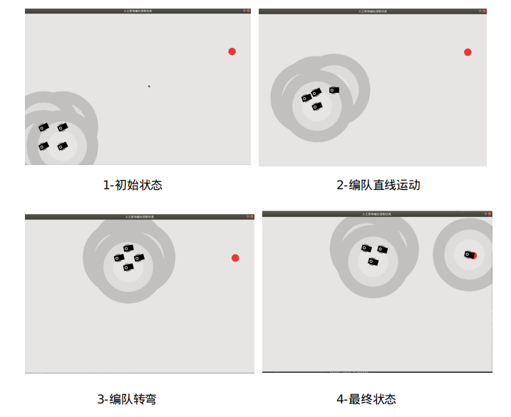

# 基于人工势场的机器人领航编队控制算法研究

**摘要**: 在本次大创项目课题研究中,本人主要负责机器人编队控制模块,针对机器人如何形成聚合的编队问题采用了基于人工势场法的领航编队控制算法,并利用python及pygame模块进行了算法仿真.仿真实验结果表明:机器人小车在形成编队时,存在前进方向变换延时的影响,容易导致编队内小车转弯时掉队的现象.同时形成稳定编队后,编队内机器人存在方向角变换波动.除仿真外,本人还进行了ros及其仿真代码\队形控制算法的学习.

**关键词**: 人工势场法, 领航编队控制算法, 队形控制算法

## 1. 引言
在多智能机器人的大量控制问题中,编队控制问题是多智能机器人控制的核心,对此许多研究人员也提出了多种解决方法,例如基于势场的控制算法\基于领航编队的控制算法等.

对于势场法控制算法,Lv, Yongshen, Yang[1]等针对UGV运货小车编队控制问题，使用了人工势场控制算法,该方法结合了UGV（运货小车）之间的避碰、机器人聚集以及速度匹配规则。对于领航编队控制算法, J.Guo, Z.lin[2]等提出了具有两个领航者的三角形编队控制算法, 由3个机器人形成的三角形编队进一步扩充,形成了适合多机器人的条形编队. Lin Z 、Wang L 和Han Z[3]等人则集中讨论多机器人形成任意特定队形的基本协调问题,提出了一种基于复数的拉普拉斯变换新技术，解决了在保证全局稳定的情况下，各内部机器人如何形成其在特定编队中的相对位置，以及如何完成编队控制的问题。

在本项目的小车编队控制问题中,本人采用了Lv, Yongshen, Yang[1]的人工势场控制算法以及领航编队控制算法,使用了python以及pygame进行机器人运动仿真.

## 2. 控制策略
在这一部分,本文将介绍使用的分布式人工势场小车控制策略,分别对跟随者和领导者的控制策略进行数学化表述.

### 2.1 控制策略的基本假设
假设使用的智能小车(酷HI只能微型机器车)为一个高128厘米,长373厘米,宽230厘米的长方体盒子,底部拥有一对驱动主轮,一对方向控制小轮,车上搭再激光雷达,能够360度获取同一水平面上物体与自身的距离,小车实物参数图如下图所示.

小车的运动符合如下规则:(部分还需改为数学语言)
+ A.小车只能前进.后退以及转向,不能平移运动
+ B.编队内部小车之间需保持一个指定的最大安全距离,避免小车之间的碰撞
$$||x_i - x_j|| < \delta_i ,i,j=1,...,M$$
+ C.小车运动速度不得大于指定最大行进速度
$$0 < ||v_i|| < V_{max}$$

此外,做如下正方向以及坐标系的规定.规定小车的坐标系采用满足ros标准\右手定则的动态坐标系,即对于每一辆小车,坐标中心均为其本身的几何中心,小车前进的方向为x轴正方向,与x轴处于同一平面且正交的为y轴,y轴正方向与x轴正方向垂直向左,z轴垂直于x\y轴构成的平面,方向垂直向上.

### 2.2 跟随者的控制策略
跟随者部分将采用人工势场函数对小车运动速度以及姿态进行控制,势场函数如下:
$$FF_i = F^{iL}(x^i - x^L) + \sum^{M}_{j=1,j\neq i} f^{ij}(x^i - x^j),i=1,...,M$$

$$f^{ij}(x^i - x^j) = -a_i \frac{x^i - x^j}{||x^i - x^j||}[ 1 - \frac{\delta_i}{||x^i - x^j||}],||x^i - x^j|| < \lambda_i$$

$$F^{iL}(x^i - x^L) = -b_i \frac{x^i - x^L}{||x^i - x^L||}[ 1 - \frac{\delta_i}{||x^i - x^L||}],||x^i - x^L|| < \lambda_i$$

其中, $FF_i$ ( follower force i )为机器人小车 i 的受到的人工势场合力, $x_i$ 为机器人小车 i 的空间坐标向量, $f^{ij}$ 为机器人 i 受到机器人 j 作用的势场力计算函数,$f^{iL}$ 为机器人 i 受到领航者作用的势场力计算函数, $a_i$ 和 $b_i$ 为作用力参数, $\delta_i$ 为安全距离参数. $\lambda_i$ 为最大势场作用距离.

跟随者小车能够获取临近小车的距离信息,并根据势场函数计算出人工势场作用力合力的大小以及方向.通过这些信息,小车将调整自身正方向朝向至所受合力的朝向,前进或后退,进而保持小车相互之间安全距离.

### 2.3 领航者的控制策略
领航者的势场函数除了受到跟随者势场作用外,还需受到目标点的吸引力势场作用.
$$LF = g(x^L) + \sum^{M}_{j=1,j\neq i} f^{iL}(x^i - x^L) ,i=1,...,M$$

$$f^{iL}(x^i - x^L) = -a_i \frac{x^i - x^L}{||x^i - x^L||}[ 1 - \frac{\delta_i}{||x^i - x^L||}],||x^i - x^L|| < \lambda_i$$

$$g(x^L) = -c_i \frac{x^G - x^L}{||x^G - x^L||}[ 1 - \frac{\delta_i}{||x^G - x^L||}]$$

其中,LF( leader force )为领航者所收到跟随者的势场作用力, $g(x^L)$ 为领航者收到目标点的吸引力, $c_i$ 为势场作用力参数, $x^G$为目标点坐标向量.

此外, 领航者需判断编队内的机器人是否已经形成编队,判断约束条件为:
$$||x_{ij}|| < \lambda_i ,i,j = 1,...,M$$
作用力参数 $a_i$ , $b_i$ , $c_i$ 的大小关系为:
$$a_i < b_i = c_i$$
$a_i$ 代表跟随者之间相互受到作用力的参数, $b_i$ 代表跟随者受到领航者作用力的影响参数,$c_i$ 代表领航者受到目标点作用力的影响参数

当领航者发现有跟随者掉队,将采取容错措施.目前采取的容错措施为领航者一检测到有跟随者掉队,立即停止运动一段时间

## 3. 仿真情况
此仿真情况下: $a_i = 20$, $b_i = c_i=30$

仿真结果如下图所示:

进一步的仿真效果可以查看附件中的 "仿真程序运行情况.mp4" 文件

## 4. 仿真结果分析
由仿真运行结果可见,编队开始一段时间后,在领航者的带领下基本能够保证所有机器人不脱离编队,但在遇到领航者突发的转弯的时候,编队队形无法维持.最终领航者脱离编队,独自到达目标点.

在编队行进的过程中,部分机器人小车之间的距离过小,可能已经发生碰撞.

初步分析后,对仿真结果的分析本人产生了一下几种猜测:
+ 机器人调整方向需消耗一定时间,且方向无法统一,从而造成编队内持续波动,不稳定
+ 不同机器人类型之间的作用力参数差异,容易导致编队运动过程中机器人碰撞

针对上述仿真出现的问题,本人正在继续阅读研究有关编队队形控制的论文,目前有两种改进思路.

第一种思路,是编队外围采用多领航者机制约束队形,编队内继续采用人工势场.

第二种思路,是结合 "复数拉普拉斯变换~"[3]一文中的编队控制原理,从而控制队形稳定,这部分仍需进一步仔细研究

## 5. 引用文献
[1]Lv, Yongshen, Yang, et al. Formation Control of UGVs Based on Artificial Potential Field[C]// 第37届中国控制会议. 2018.

[2]Guo, Lin, Cao, et al. Adaptive control schemes for mobile robot formations with triangularised structures[J]. Control Theory & Applications Iet, 2010, 4(9):1817-1827.

[3]Lin Z , Wang L , Han Z , et al. Distributed Formation Control of Multi-Agent Systems Using Complex Laplacian[J]. IEEE Transactions on Automatic Control, 2014, 59(7):1765-1777.
