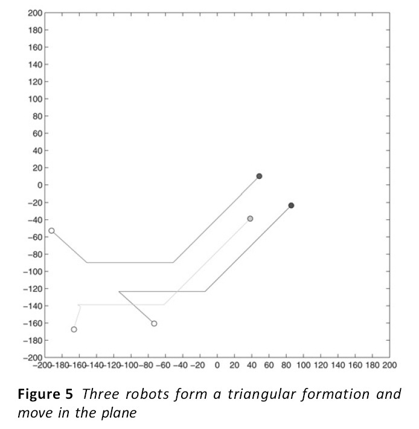
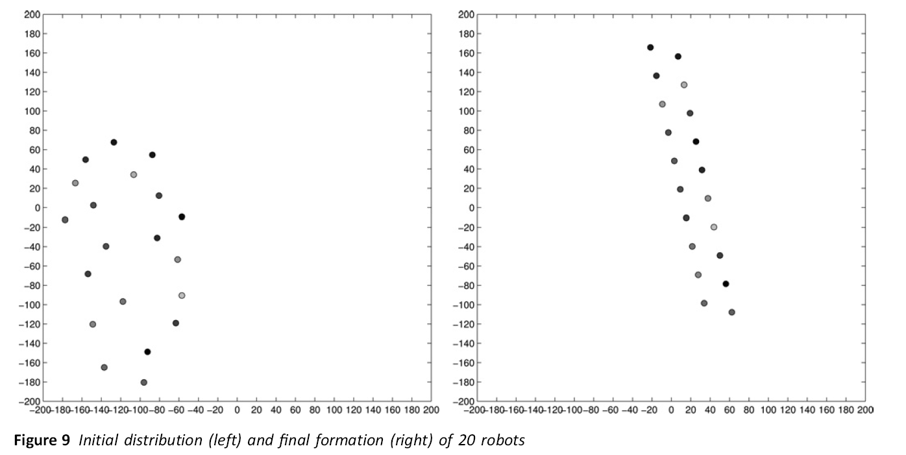
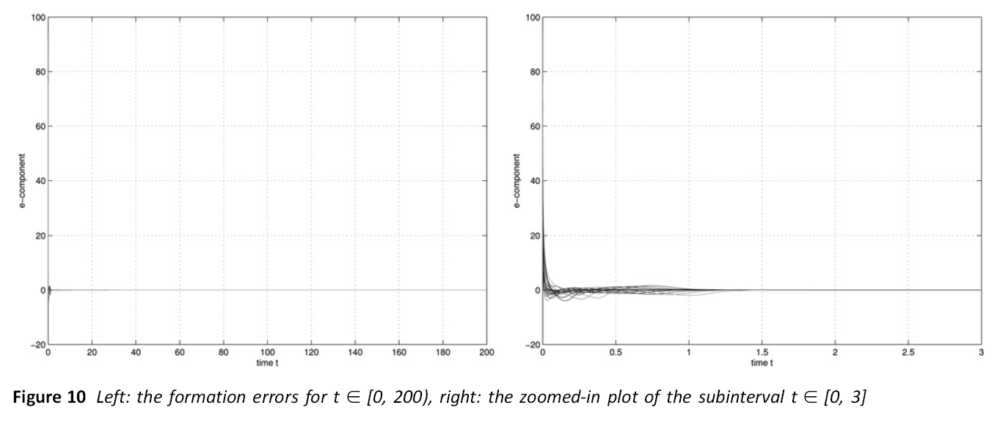

# 论文阅读笔记
## 1. 论文题目:
Adaptive control schemes for mobile robot formations with triangularised structures

三角形化结构移动机器人编队的自适应控制方案
## 2. 摘要翻译：
本研究探讨了领导者与跟随者的群体控制问题，其目标是控制一组机器人，使它们以规定的恒定速度作刚性的群体运动。本研究假设有两个领头机器人，它们是组中唯一被告知规定速度的机器人。其他机器人都是跟随者，没有参考速度信息。作者将机器人编队作为耦合的三角形子编队，提出了自适应控制策略，使每个跟随机器人相对于它的两个前导相邻机器人保持一个稳定的三角形编队。结果，整个群体形成了一个稳定（rigid）的队形。对平衡编队的收敛性和稳定性进行了分析，结果表明所期望的编队是渐近稳定的。最后，给出了仿真结果。

## 3. 论文内容个人理解
这篇论文的研究的主要创新点和重点个人总结分别如下：
+ 讨论双领导者的编队控制机制
+ 研究运动过程中编队三角队形的维持问题，以及策略收敛性证明
+ 控制策略仿真结果和存在问题

首先，先介绍论文中提及的双领导者控制机制。编队中，双领导者之间存在一定的安全距离避免碰撞，因此其公式所表征的运动速度约束与领导者之间的距离有关。论文中提出的控制策略如下：
$$ x_1' = v_0 + ( x_2 - x_1 ) (|| x_2 - x_1  ||^2 - d_{12}^2)
$$
$$x_2' = v_0 + ( x_1 - x_2 ) (|| x_2 - x_1  ||^2 - d_{12}^2)
$$
其中 $x_1' = v_1$ 代表（领航者）机器人1的速度， $x_2'$ 同理，$||x_1 - x_2||$代表领导者机器人1、2之间的实际距离，$d_{12}$代表领导者机器人1、2之间的预期设定距离

论文中对此控制策略最终领导者之间距离的收敛性进行了证明，在此不详细解释，可自行查看论文 3.1 小节

对于跟随者，论文提出的方法的鲜明特点是：跟随者只能够获取其最邻近的几个机器人的位置信息。在编队中，跟随者本身并不知道编队的目标（平衡）行进速度，只能够通过保持与临近机器人的距离从而跟随编队。而编队整体的运动速度，有领导者掌握。跟随者的控制机制如下：
$$x_3' = \theta_3 + ( x_1 - x_3 ) (|| x_1 - x_3  ||^2 - d_{13}^2) + ( x_2 - x_3 ) (|| x_2 - x_3  ||^2 - d_{23}^2)
$$
$$\theta_3' = ( x_1 - x_3 ) (|| x_1 - x_3  ||^2 - d_{13}^2) + ( x_2 - x_3 ) (|| x_2 - x_3  ||^2 - d_{23}^2)
$$
其中，大部分符号的含义与上面的公式的含义大同小异，只是符号 $\theta$ 所代表的含义文章没有明确的说明，猜测应该是角速度（叠加上机器人速度？）

同领导者控制策略的距离收敛性一样，论文也对跟随者之间的距离收敛性进行了证明，这一部分占论文的很大一部分，同时也对编队控制的结果进行了探讨，详细可阅读论文的 3.2 小节.

仿真结果如下：

以上的跟随者公式仅针对与编队中包含3个机器人的情况，进一步推广到多个机器人的情况如下：
$$x_i' = \theta_i + ( x_{i-2} - x_i ) (|| x_{i-2} - x_i  ||^2 - d_{(i-2)i}^2) + ( x_{i-1} - x_i ) (|| x_{i-1} - x_i  ||^2 - d_{(i-1)i}^2)
$$
$$\theta_3' = ( x_{i-2} - x_i ) (|| x_{i-2} - x_i  ||^2 - d_{(i-2)i}^2) + ( x_{i-1} - x_i ) (|| x_{i-1} - x_i  ||^2 - d_{(i-1)i}^2)
$$

有20个机器人的编队仿真结果如下：（左侧为初始状态，右侧为稳定状态）

除此之外，论文在推导的过程中，提及到了一个相对误差变量（实际与预期误差），在20个机器人的编队中变化为：

更多的仿真结果图可以参考论文 第 4 节 Simulation 中对结果图表的介绍查阅

论文中的一些结论，已用颜色笔标记

## 4. 参考意义
这篇论文提供了一个在处理编队队形控制的新思路，即采用多领导者机制。对于文中的“长形”编队队形的形成，我有一个猜测，原因在于其控制公式中一个follower仅能够获知临近的两个、顺序编号的机器人的位置信息，正是因为机器人编号顺序以及“两个”的原因，机器人趋于形成一种由多个平行四边形组成的长条形队形。这对于我们如何形成长条型队形有借鉴意义。

同时，我也产生了一种想法，即使用多领导者作为边界，控制模式类似本论文中的相互约束，而跟随者则可以采用人工势场的方式紧跟领导者并避免编队内碰撞，从而实现任意编队的控制。

另外，这篇论文一开始看的时候还以为是外国人写的（荷兰的某排名第二的高校），以为能够获知外国人的研究情况，但后来才发现仅有一人如此，实际上为该学校与国内高校合作的论文，而且作者应该都是中国人.此外还找到了几篇外国人写的队形相关论文,但是是属于IFAC或IEEE的会议论文,非期刊.