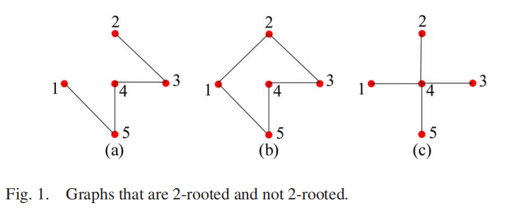
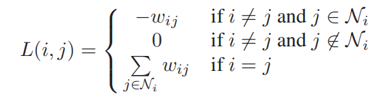

# 使用复杂拉普拉斯算子的分布式多智能体编队控制
## 1. 摘要翻译(由于句型过于复杂,这里不直译,按个人理解表述)
本论文集中讨论多机器人形成任意特定队形的基本协调问题.本文提出了一种基于复杂拉普拉斯变换的新技术，解决了在保证全局稳定的情况下，各内部机器人如何形成其在特定编队中的相对位置,以及如何完成编队控制的问题。关于第一个问题,我们展示了所有相似的队形可以表示成一个满足特定矩阵条件的空拉普拉斯(变换),以及,一个编队队形能够被明显的辨识到,当且仅当以特定内部机器人编队建立的图是有两个根节点的.针对第二个问题，本文基于指定目标形状的复杂拉普拉斯算子，提出了一个分布式线性控制律，并给出了闭环系统在理想位置的稳定增益为特征值的可证明的存在条件。此外，我们还证明了，当一组机器人子编队感知到预期编队大小改变,而其他智能体不需要重新设计和改变控制律时，如何对编队队形控制规则进行拓展以使其能够完成精确的队形控制。
## 二 摘要原文
Abstract—The paper concentrates on the fundamental coordination problem that requires a network of agents to achieve a specific but arbitrary formation shape. A new technique based on complex Laplacian is introduced to address the problems of which
formation shapes specified by inter-agent relative positions can be formed and how they can be achieved with distributed control ensuring global stability. Concerning the first question, we show that all similar formations subject to only shape constraints are those that lie in the null space of a complex Laplacian satisfying certain rank condition and that a formation shape can be realized almost surely if and only if the graph modeling the inter-agent specification of the formation shape is 2-rooted. Concerning the second question, a distributed and linear control law is developed based on the complex Laplacian specifying the target formation shape, and provable existence conditions of stabilizing gains to assign the eigenvalues of the closed-loop system at desired locations are given. Moreover, we show how the formation shape control law is extended to achieve a rigid formation if a subset of knowledgable agents knowing the desired formation size scales the formation while the rest agents do not need to re-design and change their control laws.
## 2. 论文研读
文章实际上分为6个部分:第一部分是对研究方向的背景做的粗略描述,不过还是可以参考其中提到的一些关于编队控制的文章,其中囊括的编队控制方法概括得比较全面;第二部分是对一些符号进行定义,以及关于图论背景知识的介绍;第三部分,是对一些编队仿真必要且重要的条件/公式,进行推导和分析;第四部分是所建立的多机器人编队模型的全局稳定性分析;第五部分是模型的仿真结果;第六部分是对本文工作和要点的总结,以及本文存在的一些问题.       

这里将主要研读第2\3\4部分,因为这是论文的核心,也会粗略的提一下第六部分中总结的问题,至于其他部分,感兴趣的同学可以自行阅读原文.

### 2.1 第二部分(背景知识及符号定义)
由于本文将涉及复数/矩阵运算,所以定义了如下符号

符号|含义
-|-|
$C$|复数集
$R$|实数集
$\iota$|复数的变量单位,为$\sqrt{-1}$
$\|p\| (其中p \in C)$|为p的模
$\|\xi\|(其中 \xi是一个集合)$|为集合$\xi$的基数(集合中元素个数)|
$l_n$|n维(矩阵的秩为n的)的单位向量|
$I_n$|n维的单位矩阵|
$A=[A_1,...,A_n]$|对角(分块)矩阵|
$db[A_1,...,A_n]$|反对角(分块)矩阵|
以下为关于图论的背景知识
#### 2.1.1 最最最最基础的知识
有关图中节点和边(带权,不带权)的表示/路径/步长/终端节点/内部节点/邻居节点(用 $N_i=\{j:(j,i)\in \xi)\}$ 表示邻居节点集合)/哈密顿图/双向联通图...等等的一些概念的定义自行理解
#### 2.1.2 本文涉及的两个重要图论概念
**2-可达点(2-reachable node)**:双向联通图中,如果过存在一个不只包含一个元素的集合 $u
$ 使得,存在一个不包含在 $u$ 内的点 $v$ 在图中移除一个非 $v$ 节点后,仍存在一条路径从集合 $u$ 到节点 $v$ 的路径,那么该点是一个2-可达点.

**存在2个根的图(2-rooted graph)** : 在双向联通图中,存在一个包含2个点的点集的子集,使得图中任意的点都是 *2-可达点(2-reached node)* ,那么该图就是存在2个根的图.

如上图所示(a)(b)是 **2-rooted graph**,而(3)不是,因为如果(3)去掉点4,会使得其余点都不互相联通,从而都不是 **2-reached point** .

本文使用了一个复数拉普拉斯算子来定义边的权值的分段函数 (其中 $w_{ij} \in C$ ):

由于该函数是用来描述双向联通图的,所以该矩阵的零与非零部分应该是对称的,但是实际上可能会因同一对点之间两条有方向边的权值不同而不对称.
这里定义的复数拉普拉斯函数,与实数拉普拉斯函数不同点在于其矩阵中的非零元素可以为复数,所以这个复数拉普拉斯矩阵在原点至少有一个特征值,这个特征向量为 $l_n$

置换矩阵是一个仅由0-1组成的矩阵,使用置换矩对图的节点进行重新编号,相当与对拉普拉斯矩阵进行变换. 写成
$$ L' = PLP^T$$
其中, $L$ 和 $L'$ 为拉普拉斯之前和之后的排序的节点矩阵, $P$ 是相应的置换矩阵
### 2.2 第三部分(编队仿真条件充要条件)
在论文的这一部分,作者又细分成ABCD四部分.
+ A 重新回顾了什么是刚性的(队形)骨架以及全局刚性(队形)骨架
+ B 提出了线性约束条件和用于表示编队的二元组近似条件
+ C 提出了二元组近似条件的充分必要条件,并给出证明
+ D 提出了构造置换矩阵L的系统性方法

对A,本文回顾了刚性骨架以及全局刚性骨架的定义.所谓刚性骨架(个人理解),就是保证图上的每一个节点都能够在边的约束下,固定在一个位置,使整个图不存在满足这组点-边关系的其他状态(也就是只用一种状态).全局刚性骨架,就是本点-边关系下,除了自身的排列方式外,不存在其他的(化学中的概念)"异构体"

对B,根据A中的定义,这里给出的是满足刚性/全局刚性骨架的线性约束条件与相似性条件.核心就是两条公式      
(由于符号定义前面已经提及,这里就不再赘述,可以参照前面的变量定义)
$$ \sum_{j \in N_i}w_{ij}(\xi_j - \xi_i) = 0$$
$$ L\xi = 0$$

对C,本文给出了有关刚性骨架的充分必要条件及其证明(涉及到一系列的引理和定理), **当一个图是2-rooted grath时,当且仅当这个图满足刚性骨架的线性约束条件**

对D,这一部分提出了构造置换矩阵L的系统性方法
### 2.3 第四部分(多机器人的编队控制系统)
这部分也可以划分为及部分
+ A 多机器人编队的稳定性问题描述
+ B 本地的编队队形控制策略
+ C 稳定矩阵的存在性证明
+ D 设计稳定性矩阵
+ E 对刚性编队控制的拓展

### 2.4 第五部分(仿真实验结果)
在这一部分,作者根据上面分析的结论,进行了仿真和实物实验.仿真中构造了有18个机器人的编队,并定义了其最终达到的目标队形.在实物实验中,构造了有6个机器人及预设目标队形的机器人编队.

### 2.5 第六部分(总结)
作者在这里对全文的内容进行了总结,以及本论文中的基础理论对与多方面的影响和用途.

## 3 论文对项目的参考价值
这篇论文较为全面的讲述了编队控制在队形控制这一块的控制方法,对于我们项目中设计的编队队形的变换非常有帮助.同时,如果过我们后期能够在这篇论文的研究基础上,加上对编队内部的容错以及避碰机制以及容错机制,从而保证编队的队形,将会是一个在编队控制上的创新点.