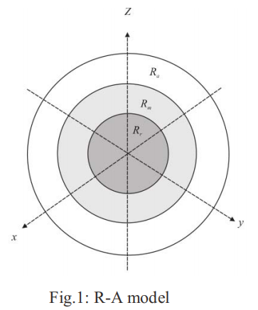
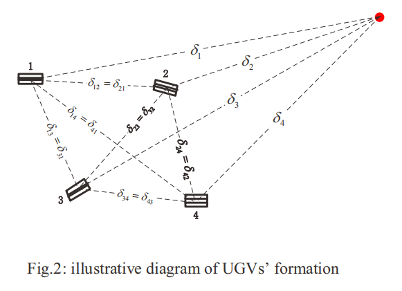

# 基于人工势场的商场送货机器人编队控制
## 摘要翻译
针对UGV在运动过程中的编队控制问题，我们提出了一种基于人工势场的UGV编队控制方法，该方法结合了UGV（运货小车）之间的避碰、机器人聚集以及速度匹配规则。本文首先根据运动规则，建立了UGV的动力学模型，然后设计了基于人工势场公式的编队控制算法，该控制算法主要用于UGV移动过程中的队形控制。最后，通过仿真以及物理实验得出的结果，验证了编队控制方法的有效性，也证明了该算法适用于大型UGV的编队控制。
## 本论文对项目的价值
该论文提供了人工势场的实现过程中具体的动力学公式，可用作本项目设计人工势场公式的参考。但由于本文实际上只能当作使用人工势场编队控制方法的一个应用实例，所以本文只需要学习其是如何建立数学关系即可，对于其他部分不必深究。本笔记也将只是侧重于详细讲解其实现思路及公式内涵。

总体来说,算法思路比较简单.对这篇论文的实验情况的分析后,我认为如果直接采用该方法,需要改进的一些问题:
* 采用leader-follower算法,这意味着编队在开始/停止运行时,达到平衡需要一定时间(始末稳定性较差)
* 无法人为设定规定队形
* 无容错性,发生故障即掉队
## 论文实现思路研读
本论文的核心在于三部分: **小车之间的避碰**,**速度匹配**,**小车聚集**       

    
(图片中3个区域由内到外分别为Rr,Rm,Ra,由内到外半径分别为0,dr,dm,da)

定义三个基本区域:
区域Rr(repulsive region),在本区域内,将产生斥力,使UGV之间避免碰撞.
$$R^i_r = \{x_i | 0 < d_{ij} \leq d_r , x_i \in R_n\} $$
区域Ra(attractive region),在本区域内,将产生吸引力,使UGV之间聚集为编队.
$$R^i_a = \{x_i | d_m < d_{ij} \leq d_a , x_i \in R_n\} $$
区域Rm(unanimous region),为UGV处于平衡态的区域.
$$R^i_r = \{x_i | d_r < d_{ij} \leq d_m , x_i \in R_n\} $$

### 1.小车的动力学描述模型
假设UGV编队的位置信息为:(共有M个个体),公式中的 $x_i$ 为一个具有位置信息的向量.
$$ X = (x_1,x_2,...,x_i,...x_M)$$
速度公式为:
$$v_i = x_i' $$
### 2.速度约束条件(定义域)
$$v_i = \begin{cases}
    v_i ,& ||v_i|| \leq V_{max}\\
    V_{max}\frac{v_i}{||v_i||} ,& ||v_i|| > V_{max}
\end{cases}
$$
### 3.速度计算公式(人工势场速度约束)
公式中的 $g^i(.)$为小车i与虚拟领航者(leader)之间的作用力计算函数, $g^{ij}(.)$为小车i与小车j之间的作用力里计算函数
$$v_i  = x_i'= g^i(x^i - x^L) + \sum^{M}_{j=1,j\neq i} g^{ij}(x^i - x^j),i=1,...,M$$
### 4.人工势场力的计算函数定义
公式中的 $a_i$为作用力参数, $\delta_i$为设定的平衡距离
$$g^i(x^i - x^L) = -a_i \frac{x^i - x^L}{||x^i - x^L||}[ 1 - \frac{\delta_i}{||x^i - x^L||}]$$
$$g^{ij}(x^i - x^j) = -a_i \frac{x^i - x^j}{||x^i - x^j||}[ 1 - \frac{\delta_i}{||x^i - x^j||}]$$

### 5.效果图 
下图中,四个有标号的方盒代表4个UGV小车,红点为**虚拟领航者**
