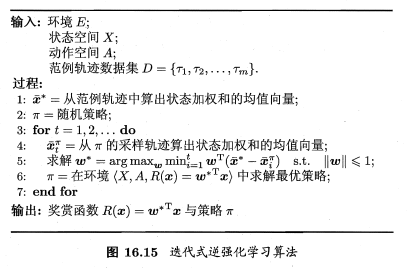

# 逆强化学习笔记
<!-- TOC -->

- [逆强化学习笔记](#逆强化学习笔记)
  - [1.逆强化学习与强化学习的联系](#1逆强化学习与强化学习的联系)
  - [2.模仿学习/示教学习的分类](#2模仿学习示教学习的分类)
  - [3.逆强化学习](#3逆强化学习)
    - [3.1 学徒学习](#31-学徒学习)

<!-- /TOC -->
## 1.逆强化学习与强化学习的联系
强化学习的基本模型是马尔可夫决策过程（Markov Decision Process,MDP），其可以使用五元组来表示： $(S,A,P,R,T/\gamma)$ ，分别代表状态空间、动作空间、状态转移概率、奖赏函数、迭代次数（折损因子）。实际上，在之前的学习中，我们已经知道，根据转移概率 $P$ 是否为已知，可以将强化学习分为 **有模型强化学习** 和 **免模型强化学习** 。同理，逆强化就是研究五元组中奖赏函数 $R$ 的。

奖赏函数作为参与强化学习的一个基本条件，不同的奖赏函数可能会对模型的最终价值产生影响。在普通的强化学习中，我们通常只是将目标点的奖赏值设置为一个正的很大的数，将环境中类似于陷阱、墙壁等的状态奖赏值设置为一个负的数，但对于路径过程中其他状态的处理往往过于简单，例如全部设定为某一固定的值，这种做法存在着一定的欠缺。

另一方面，在实际的强化学习多步决策任务中，搜索空间十分巨大，我们能否通过利用已有的人类专家的决策过程，进而加快策略收敛、提上算法效率呢？

所以，通过利用人类专家的决策过程范例，来学习奖赏函数的逆强化学习应运而生。

## 2.模仿学习/示教学习的分类
模仿学习(imitation learning)是指利用已有人类专家决策过程进行学习的方法。模仿学习可分为直接模仿学习/行为克隆、逆强化学习、基于博弈的模仿学习等。

所谓直接模仿学习，即直接从人类专家的决策轨迹数据中，利用监督学习的方法学习获得模型。

例如我们现在已获得了一批人类专家的决策轨迹数据如下：
$$\tau_i = <s_{1}^{i},a_{1}^{i},s_{2}^{i},a_{2}^{i},...,s_{n_i+1}^{i}> , i=1,2,...$$
其中 $n_i$ 为第i条轨迹中的转移次数。有了这批人类专家的轨迹数据相当于拥有了一批标签数据，即可以以状态为特征，动作为标记，将轨迹中的“状态-动作”对抽取出来形成标签数据集合：
$$D = {(s_1,a_1),(s_2,a_2),...(s_{\sum^{m}_{i=1}n_i},a_{\sum^{m}_{i=1}n_i})}$$
接着就可以使用分类（对离散动作空间）、回归（对连续动作空间）等算法即可得到策略模型。

但是使用直接模型学习也存在严重的复合误差(compounding errors)并且难以有效学习到人类专家的决策行为动机，因此需要人工标记数据进行模型矫正，而这也使其无法适应状态空间较大的情况。

我们主要探讨如何从人类专家提供的范例数据中反推奖赏函数的逆强化学习。

## 3.逆强化学习
逆强化学习最早由伯克利大学的 Andrew Y.Ng 和 Stuart Russell 在《Algorithms for Inverse Reinfocement Learning》（2004）中提出。逆强化学习的核心思想为：要想训练出与人类专家范例一致行为的策略，相当于找到一种奖赏环境，而在该奖赏环境中，最有策略产生的轨迹与范例数据一致。

逆强化学习依据其求解奖赏函数的方法，可以分为如下两种：
+ 基于最大边际的方法：如学徒学习、MMP方法、结构化分类、神经逆向强化学习
+ 基于概率模型的方法：如最大熵IRL、相对熵IRL、深度逆向强化学习。

最大边际化方法的缺点是很多时候不存在单独的回报函数使得专家示例行为既是最优的又比其它任何行为好很多，或者不同的回报函数挥导致相同的专家策略，也就是说这种方法无法解决歧义问题。而基于概率模型的方法可以解决此问题。

### 3.1 学徒学习
我们假设奖赏函数能够表示为一系列确定的基函数 $\phi_1,\phi_2,...,\phi_k$，的线性组合而成，即 $R(s_i)=\omega^T \phi(s_i)$ 。基函数可以是多项式基底、傅里叶基底等。此时逆向强化学习要求得的是各基函数的系数 $\omega$ 

于是策略 $\pi$ 的累计奖赏可写为
$$\rho^{\pi}=E[\sum^{+\infty}_{t=0}\gamma^{t}R(s_t)|\pi]=E[\sum^{+\infty}_{t=0}\gamma^{t}\omega^{T}\phi(s_t)|\pi]$$
$$=\omega^{T}E[\sum^{+\infty}_{t=0}\gamma^{t}\phi(s_t)|\pi]$$

即基函数向量加权和的期望与系数 $\omega$ 的内积。

我们可以使用蒙特卡罗方法通过采样来近似期望，而人类专家范例轨迹数据集恰好可以作为最优策略的样本集，于是我们只需要将每条范例轨迹上的状态加权求和再求平均，即可得到该期望近似，记为 $\mu^{*}$ ,有
$$\mu^{*}=E[\sum^{+\infty}_{t=0}\gamma^{t}\phi(s_t)|\pi] \approx \frac{1}{m}\sum^{m}_{i=1}\sum^{\infty}_{t=0}\gamma^{t}\phi(s_t)$$
，对于最优奖赏函数 $R(s_t)=\omega^{*T}\mu(\pi)$ 和任意其他策略产生的 $\mu(\pi)$ ,有
$$\omega^{*T}\mu^{*}-\omega^{*T}\mu(\pi)=\omega^{*T}(\mu^{*}-\mu(\pi)) \geq 0$$
若对所有策略计算出 $(\mu^{*}-\mu(\pi))$，即可解出
$$\omega^{*}=\arg \max_{\omega} \min_{\pi}\omega^{*T}(\mu^{*}-\mu(\pi))$$
$$\|\omega\|\leq 1 ,s.t$$

算法伪代码如下：

具体实现可参考

https://github.com/MatthewJA/Inverse-Reinforcement-Learning

Inverse-Reinforcement-Learning/irl/linear_irl.py 中的 large_irl 函数